# Diagramas do Projeto Guardiao Digital

Este documento apresenta uma concepcao inicial do sistema Guardiao Digital, incluindo visao conceitual, arquitetura, modelo de dados e fluxos principais.

## 1. Visao Conceitual

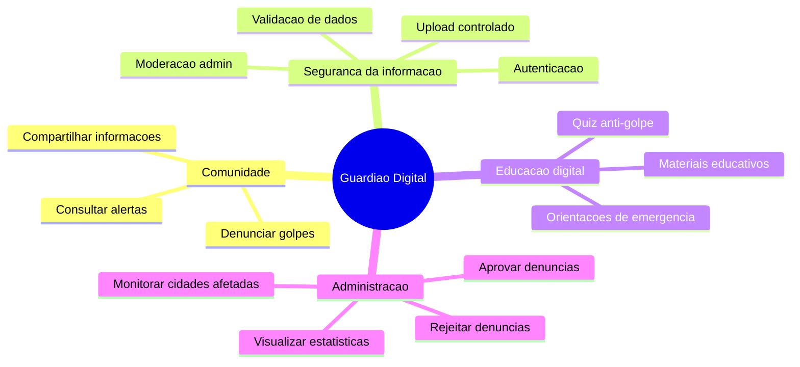

## 2. Arquitetura Geral

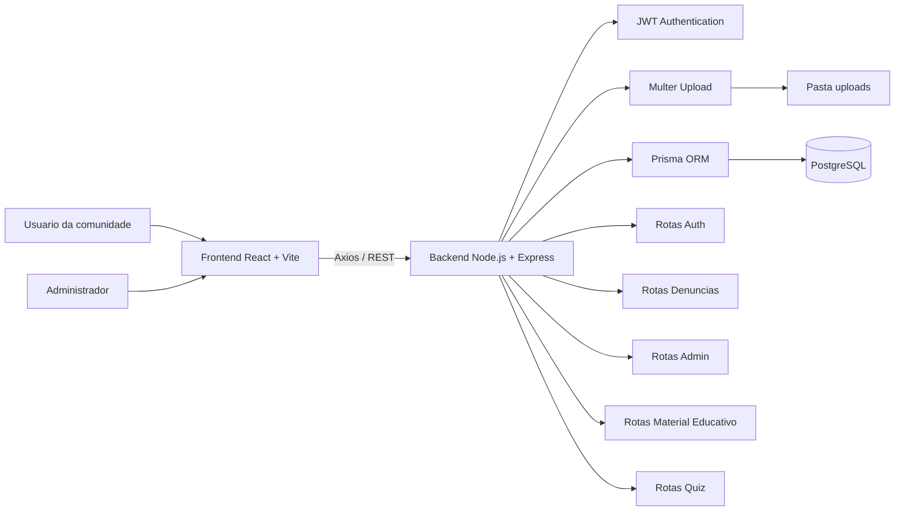

## 3. Modelo Conceitual de Dados

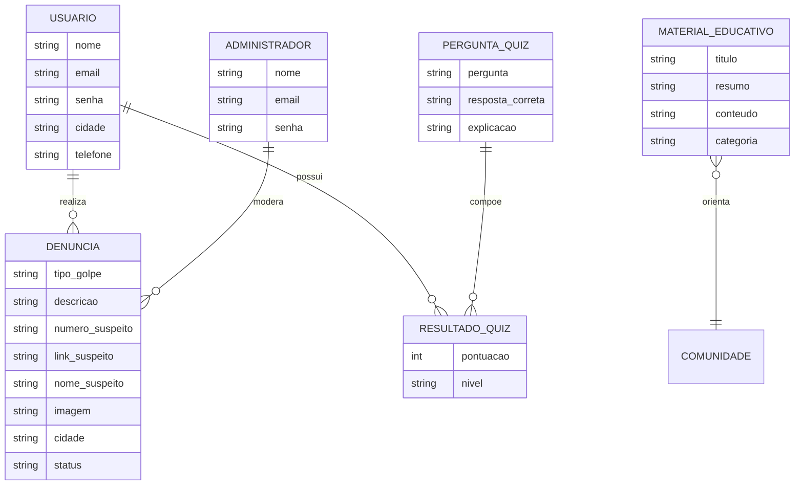

## 4. Modelo Logico

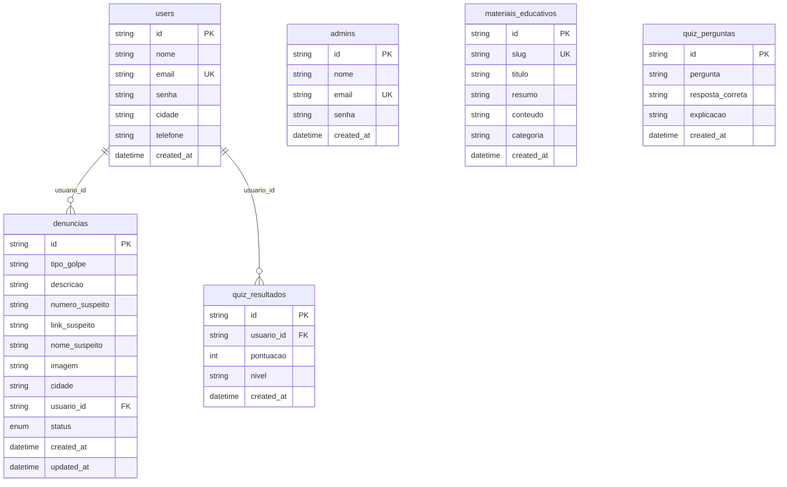

## 5. Modelo Fisico Simplificado

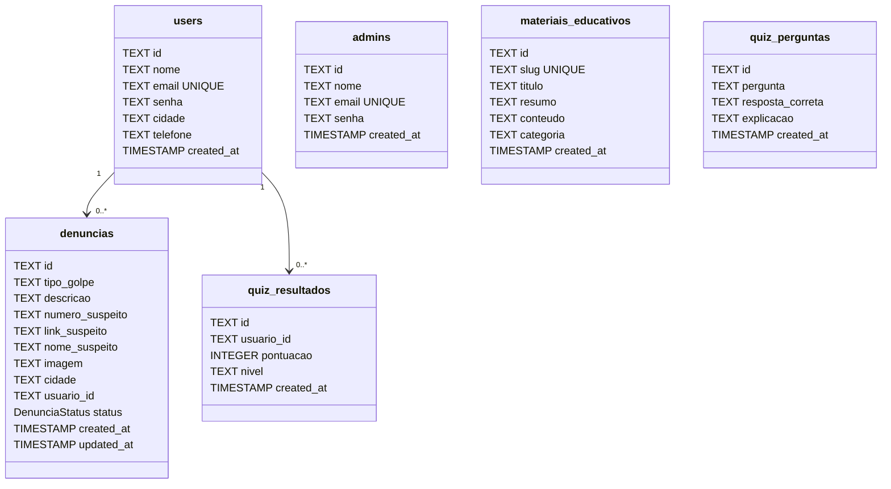

## 6. Casos de Uso

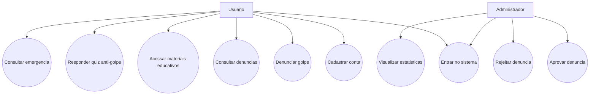

## 7. Fluxo de Denuncia

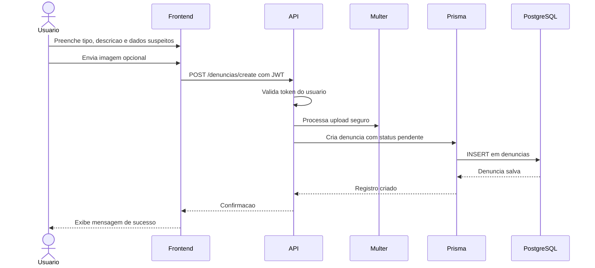

## 8. Fluxo de Moderacao Admin

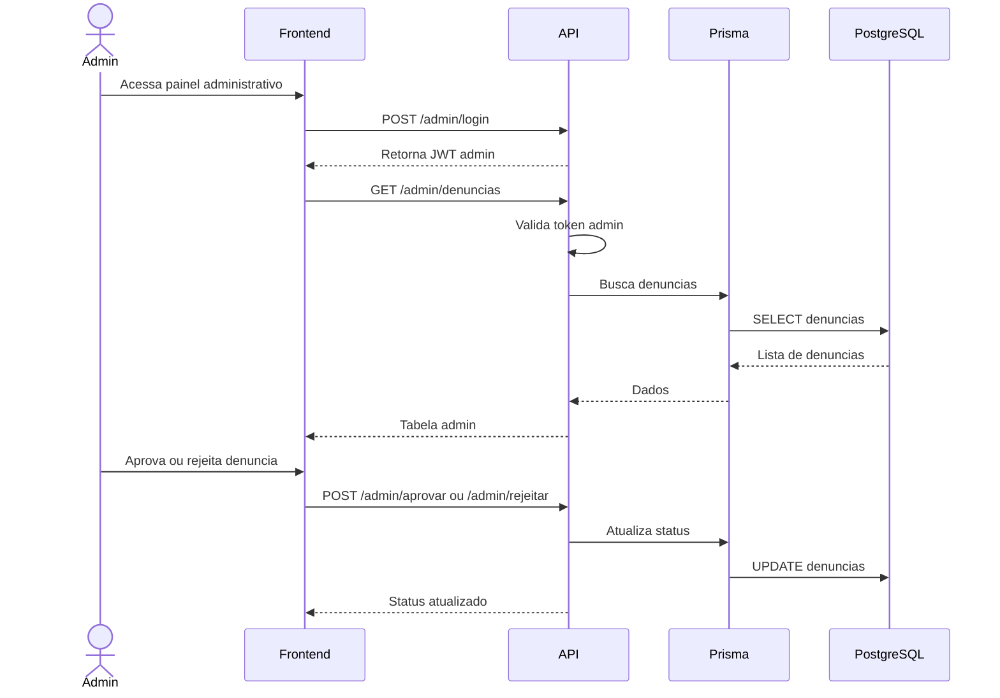

## 9. Fluxo de Consulta Publica

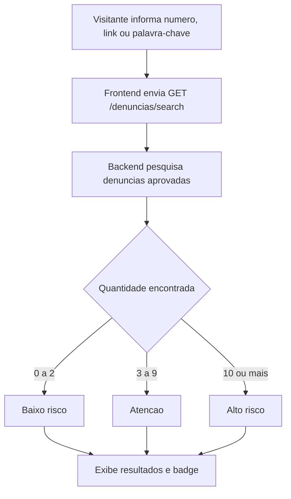

## 10. Fluxo do Quiz Anti-Golpe

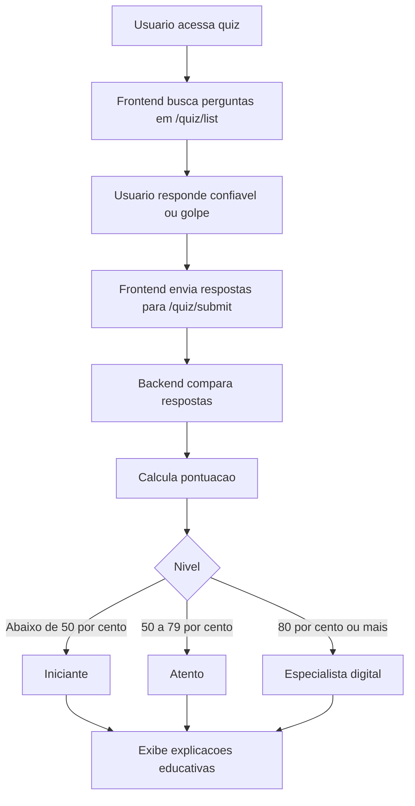

## 11. Camadas do Sistema

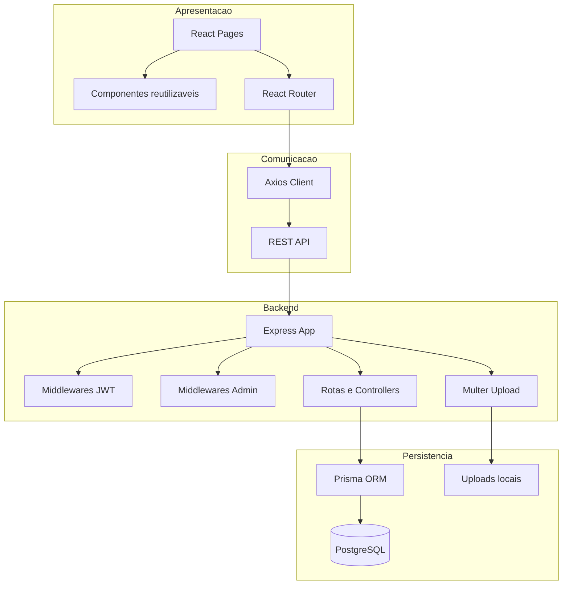
